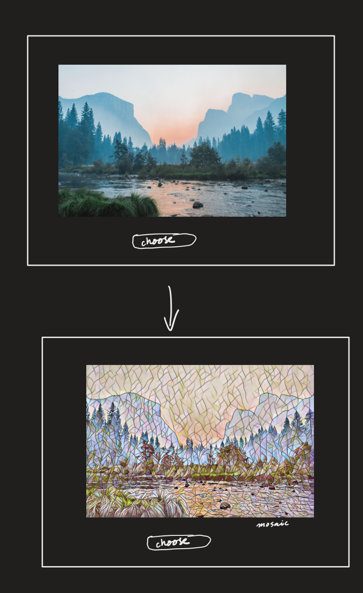

# Looking Glass ⌛︎ 

## Goal
This is what I am aiming for with PyTorch Style Transfer Model 

Heavily inspired by official pytorch example  🙏

## start 

run `make start` to build the run the docker image

This will start a jupyter lab running at localhost:8889

CUDA ready